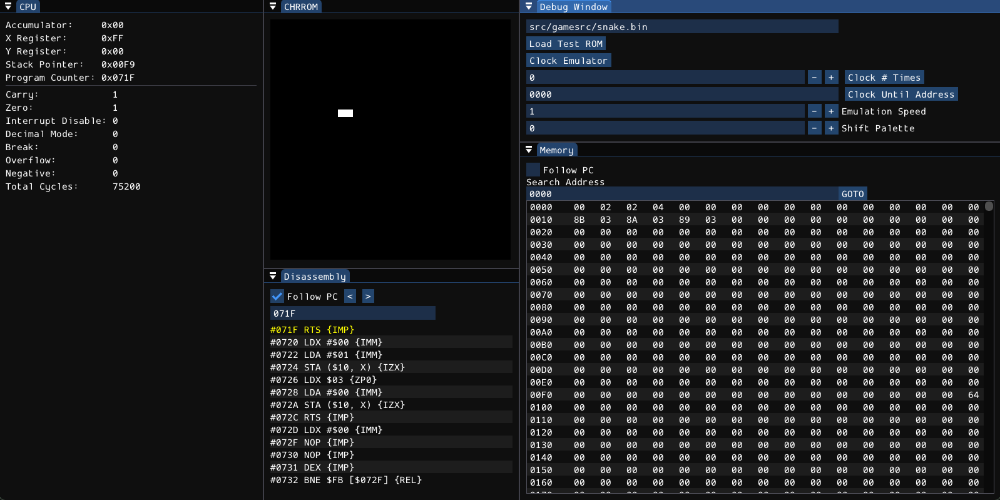

# 6502-emu
A MOS 6502 CPU emulator with an integrated debugging environment built in C++ 17. ImGui-based user interface, GLFW windowing and rendering context and GLAD for OpenGL 3.3 loading.

(most of the code is from another project of mine for an NES Emulator)

---
## Features
- Load in binary ROMs.
- Step through emulation one clock cycle at a time or run in continuous mode with configurable speed.
- View the memory via the live memory viewer or the live pixel display.
- Fully implemented 56 official opcodes across 13 addressing modes and cycle-accurate.

---
## Debug UI
Uses ImGui Docking version to render several debugging/control windows including:
- **Control:** for loading a raw binary file, changing emulation speed, offsetting the default color pallete *(looks cool)* and controlling the execution of the emulator by single-stepping or specifying a number of cycles to execute or executing until the program counter reaches a certain address.  
- **Memory:** a live memory viewer which highlights the program counter with yellow and has the ability to follow it during execution. highlights the stack pointer with cyan. can jump to specific addresses.
- **CPU:** live display of the cpu registers and status flags.
- **Disassembly:** shows the disassembled portion of a chunk of memory, by default follows the program counter, can navigate with `<` / `>` or enter an address to jump to
- **Screen Display:** reads a specific portion of memory and interprets it as indices to the default palette, can be used for displaying a screen. (right now its hardcoded to a certain memory chunk `0x0200-0x05FF` for the snake game tho )

---
## Architecture
---
Application          — top-level run loop
├── Emulator         — owns the bus, handles ROM loading & clocking
│   └── TestBus      — 64 KB flat RAM + CPU (implements the abstract Bus interface)
│       └── cpu6502  — registers, ALU, instruction decode via lookup table, disassembler
└── Window           — GLFW/OpenGL 3.3 window + ImGui debug panels + input handling

---

TestBus is meant as an example implementation of the abstract Bus interface, more complex buses can be added.

## Building

### Prerequisites
- C++17
- premake5 (included in premake/)
  
build on windows by running GenerateProjects.bat to generate the visual studio solution, and build via Visual Studio (windows only)

## Usage
- enter the path to a test binary rom.
- click `Load Test Rom`.
- step through one cycle at a time or press space to run in continuous mode.
- there is a test rom bundled in src/gamesrc/snake.bin which is a snake game written in 6502 assembly found [here](https://gist.github.com/wkjagt/9043907#file-snake6502-asm).
- play the test game using WASD.

---
## Known limitations
- some stuff are hardcoded (the chunk of memory where the display screen reads from at `0x0200-0x05FF`, the input is recorded at 0x00FF, program starts at 0x), these where the values that the test rom used, but they should be configurable for different programs.
- disassambler is kinda wonky if it starts from the middle of an instruction, it doesn't really distinguish when an instruction starts/ends.
- Decimal mode is completely unimplemented.
- overall this is a very early version so a lot of things are bound to change.

---
## Future to-do stuffs

- hooking in an external assembler for built in 6502 assembly code editing/writing and testing.
- configurable controls and I/O registers and display screen memory chunk (so you can build your own interactive programs with easy display \:D).
- save/load state

---
# Acknowledgements
- Thanks so much to OneLoneCoder's (javidx9) [NES emulator tutorial series](https://youtube.com/playlist?list=PLrOv9FMX8xJHqMvSGB_9G9nZZ_4IgteYf), the cpu6502 class is HEAVILY inspired by [his implementation](https://github.com/OneLoneCoder/olcNES). 
- License for javidx9's code can be found in [OLC-3 LICENSE](https://github.com/OneLoneCoder/olcNES/blob/master/README.md)
- The rom for the snake game can be found [here](https://gist.github.com/wkjagt/9043907#file-snake6502-asm).

